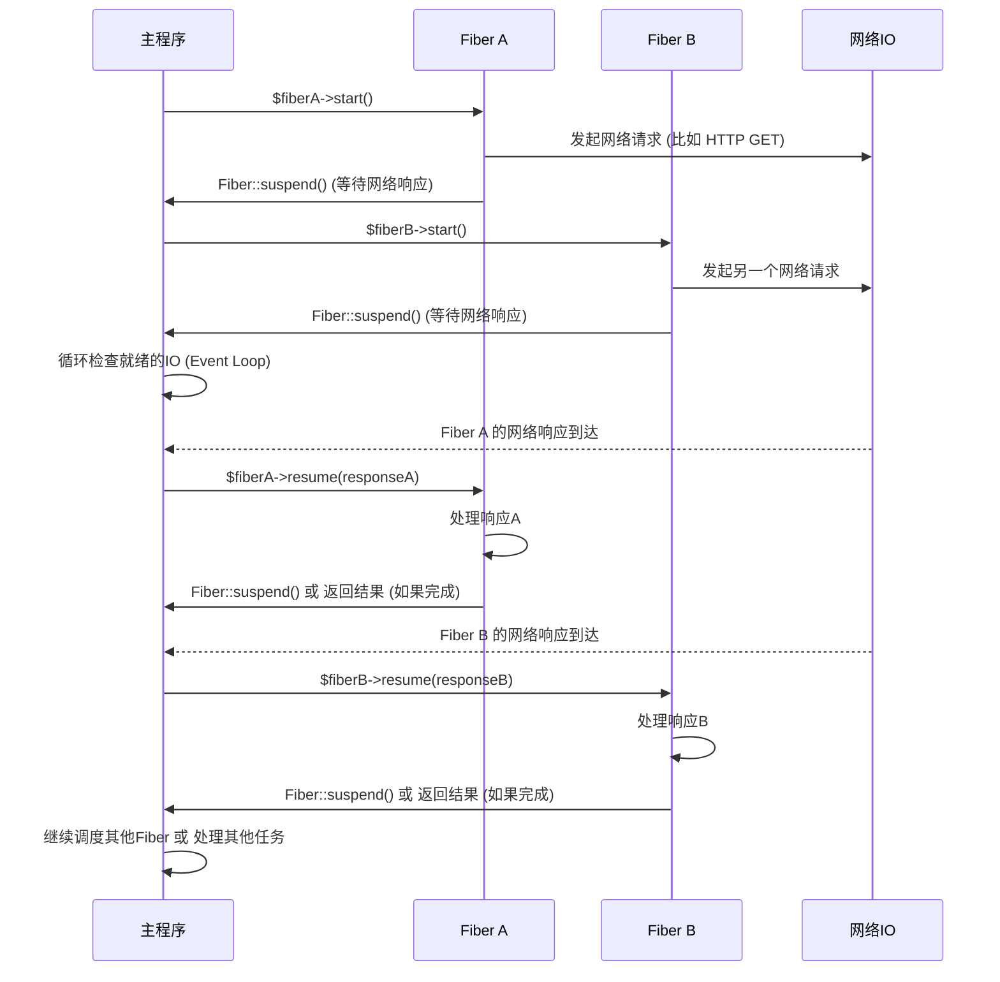

> **Fibers (协程)** 是 PHP 8.1 引入的一个重要新特性，它为 PHP 带来了原生的用户空间并发能力。与传统的线程或进程不同，Fibers 允许代码在执行过程中暂停和恢复，而无需使用生成器 (Generators) 或复杂的事件循环回调。这使得开发者能够编写更具可读性和可维护性的异步非阻塞代码，从而更好地应对 I/O 密集型任务，如网络请求、数据库查询等。


核心思想：**Fibers 是一种轻量级的并发原语，允许 PHP 代码在用户空间中实现非阻塞操作，通过显式地暂停和恢复执行，简化了异步代码的编写。**

------

## 一、为什么需要 Fibers？

在 PHP 8.1 之前，实现异步非阻塞代码通常依赖于以下两种方式：

1.  **Callbacks (回调函数)**：
    *   **优点**：简单直接，适用于简单的异步操作。
    *   **缺点**：容易陷入“回调地狱 (Callback Hell)”，代码可读性和维护性差，错误处理复杂。
2.  **Generators (生成器)**：
    *   **优点**：通过 `yield` 实现了伪协程，可以在一定程度上改善回调地狱，允许代码暂停和恢复。
    *   **缺点**：生成器本质上是迭代器，其语义更偏向于数据生成。将生成器用于协程上下文切换，需要在外部有一个调度器 (Scheduler) 明确地 `send()` 和 `next()`，实现起来较为复杂和不直观。

这两种方式都使得编写复杂的异步逻辑变得困难和笨拙。Fibers 的引入正是为了解决这些问题，提供一种更直观、更原生的方式来管理并发执行流。

**Fibers 的核心优势在于：**

*   **代码可读性**：允许以同步的方式编写异步代码，避免了深层嵌套的回调。
*   **简化复杂异步逻辑**：不再需要依赖生成器或复杂的外部调度逻辑进行上下文切换。
*   **用户空间轻量级**：比操作系统线程/进程更轻量，上下文切换开销更小。
*   **不涉及并行**：Fibers 本身不是并行执行，它们是协作式的多任务。在任何给定时间点，只有一个 Fiber 在运行，其他 Fiber 暂停等待恢复。

## 二、Fibers 的基本概念

### 2.1 什么是 Fiber？

Fiber 可以被视为一个轻量级的，用户空间级别的执行上下文。它拥有自己的栈和程序计数器，可以在任何时候被暂停，并在后续的任何时间点恢复。当一个 Fiber 被暂停时，其父 Fiber（或主执行流）将恢复执行。当一个 Fiber 被恢复时，它会从上次暂停的地方继续执行。

### 2.2 Fiber 的状态

一个 Fiber 可以处于以下几种状态：

*   **`Fiber::STATUS_INIT`**: 初始状态，尚未启动。
*   **`Fiber::STATUS_RUNNING`**: 正在执行。
*   **`Fiber::STATUS_SUSPENDED`**: 已暂停，等待恢复。
*   **`Fiber::STATUS_TERMINATED`**: 已终止（完成执行或抛出异常）。

### 2.3 `Fiber` 类的方法

PHP 提供了一个内置的 `Fiber` 类来创建和管理协程。

*   **`__construct(callable $callback)`**：
    *   创建一个新的 Fiber 实例。`$callback` 是一个可调用对象，代表 Fiber 要执行的代码。
    *   Fiber 创建后处于 `Fiber::STATUS_INIT` 状态，不会立即执行。
*   **`start(mixed ...$args): mixed`**：
    *   启动 Fiber 的执行。Fiber 会从 `$callback` 的开头开始执行。
    *   `$args` 会作为参数传递给 `$callback`。
    *   如果 Fiber 在执行过程中通过 `Fiber::suspend()` 暂停，`start()` 方法会返回 `Fiber::suspend()` 传递的值。
    *   如果 Fiber 完成执行，`start()` 方法会返回 `$callback` 的返回值。
    *   如果 Fiber 抛出异常，`start()` 方法会抛出该异常。
*   **`suspend(mixed $value = null): mixed`**：
    *   暂停当前正在执行的 Fiber，并将 `$value` 返回给恢复它的 Fiber（即调用 `start()` 或 `resume()` 的 Fiber）。
    *   当该 Fiber 再次被恢复时，`suspend()` 方法会返回 `resume()` 传递的值。
*   **`resume(mixed $value = null): mixed`**：
    *   恢复一个已暂停的 Fiber。
    *   `$value` 会作为 `Fiber::suspend()` 的返回值传递给被恢复的 Fiber。
    *   `resume()` 方法会返回被恢复 Fiber 中下一个 `Fiber::suspend()` 传递的值，或者如果 Fiber 完成执行，则返回其最终返回值。
*   **`throw(Throwable $exception): mixed`**：
    *   在暂停的 Fiber 中抛出一个异常，并恢复其执行。
    *   该异常会被被恢复的 Fiber 内部捕获（如果存在 `try...catch`），或者导致 Fiber 终止。
*   **`isStarted(): bool`**：
    *   检查 Fiber 是否已启动。
*   **`isSuspended(): bool`**：
    *   检查 Fiber 是否已暂停。
*   **`isTerminated(): bool`**：
    *   检查 Fiber 是否已终止。
*   **`getCurrent(): ?Fiber`**：
    *   获取当前正在执行的 Fiber 实例。如果当前不在 Fiber 中，则返回 `null`。
*   **`getReturn(): mixed`**：
    *   获取已终止 Fiber 的返回值。

## 三、Fibers 示例

### 3.1 简单示例：暂停与恢复

```php
<?php

$fiber = new Fiber(function (): void {
    echo "Fiber started.\n";
    $value = Fiber::suspend('Hello from Fiber!'); // 暂停并返回 'Hello from Fiber!'
    echo "Fiber resumed with: " . $value . "\n"; // 从这里继续执行
    Fiber::suspend('Another suspend!');
    echo "Fiber ending.\n";
    return 'Fiber finished!';
});

// 启动 Fiber
$res1 = $fiber->start(); 
echo "Main context received: " . $res1 . "\n"; // 输出: Main context received: Hello from Fiber!

// 恢复 Fiber
$res2 = $fiber->resume('Resumed by Main!');
echo "Main context received again: " . $res2 . "\n"; // 输出: Main context received again: Another suspend!

// 再次恢复 Fiber，并传递最终结果
$finalResult = $fiber->resume('Final resume!');
echo "Main context received final: " . $finalResult . "\n"; // 输出: Main context received final: Fiber finished!

echo "Fiber status: " . ($fiber->isTerminated() ? "Terminated" : "Running") . "\n";
?>
```

**输出：**

```
Fiber started.
Main context received: Hello from Fiber!
Fiber resumed with: Resumed by Main!
Main context received again: Another suspend!
Fiber ending.
Main context received final: Fiber finished!
Fiber status: Terminated
```

### 3.2 模拟非阻塞 I/O

Fibers 的真正威力在于与事件循环 (Event Loop) 结合，模拟非阻塞 I/O。



这是一个简化的例子，展示了如何使用 Fibers 模拟两个并发的“耗时操作”（实际上我们使用 `sleep()` 来模拟 I/O 延迟）。一个真正的异步框架会有一个事件循环来调度这些 Fibers。

```php
<?php

// 模拟一个异步 I/O 操作 (例如网络请求、文件读写)
function asyncOperation(string $name, int $delaySeconds): string
{
    echo "[Fiber $name] Starting operation, will take {$delaySeconds} seconds...\n";
    // 暂停当前 Fiber，将控制权交还给调度器/主程序
    // 实际异步框架中，这里会注册一个回调，当I/O完成后唤醒当前Fiber
    Fiber::suspend(); 
    echo "[Fiber $name] Operation resumed after {$delaySeconds} seconds.\n";
    return "[Fiber $name] Result after {$delaySeconds} seconds.";
}

// 定义一个简单的调度器 (Event Loop 的简化版)
class Scheduler
{
    private SplQueue $queue; // 存储待运行的 Fiber
    private array $waitingFibers = []; // 存储因I/O暂停的 Fiber

    public function __construct()
    {
        $this->queue = new SplQueue();
    }

    public function addFiber(Fiber $fiber): void
    {
        $this->queue->enqueue($fiber);
        $this->waitingFibers[spl_object_id($fiber)] = [
            'fiber' => $fiber,
            'start_time' => microtime(true),
            'delay' => 0, // 初始未知延迟，实际中会从任务获取
        ];
    }

    public function run(): void
    {
        while (!$this->queue->isEmpty() || !empty($this->waitingFibers)) {
            // 先处理队列中的 Fiber (模拟CPU密集型任务或已就绪的I/O)
            while (!$this->queue->isEmpty()) {
                $fiber = $this->queue->dequeue();
                if ($fiber->isTerminated()) {
                    unset($this->waitingFibers[spl_object_id($fiber)]);
                    continue;
                }

                try {
                    if (!$fiber->isStarted()) {
                        $value = $fiber->start();
                    } else {
                        $value = $fiber->resume();
                    }

                    if ($fiber->isSuspended()) {
                        // Fiber 暂停了，等待 I/O，重新放回等待池
                        // 这里简化处理，实际需要注册到真正的 I/O 多路复用器
                        // 我们模拟一个延迟后唤醒
                        $this->waitingFibers[spl_object_id($fiber)]['start_time'] = microtime(true); // 重置等待时间
                        // 假设 asyncOperation 函数会告诉调度器它需要等待多久
                        // 这里我们手动设置一个延迟，方便演示
                        if (str_contains($value, 'delay')) {
                            preg_match('/delay:(\d+)/', $value, $matches);
                            if (isset($matches[1])) {
                                $this->waitingFibers[spl_object_id($fiber)]['delay'] = (int)$matches[1];
                            }
                        } else {
                             $this->waitingFibers[spl_object_id($fiber)]['delay'] = 2; // 默认2秒
                        }

                    } elseif ($fiber->isTerminated()) {
                        echo "Fiber finished with return: " . $fiber->getReturn() . "\n";
                        unset($this->waitingFibers[spl_object_id($fiber)]);
                    }
                } catch (Throwable $e) {
                    echo "Fiber threw an exception: " . $e->getMessage() . "\n";
                    unset($this->waitingFibers[spl_object_id($fiber)]);
                }
            }

            // 检查是否有等待中的 Fiber 已满足条件 (模拟 I/O 完成)
            foreach ($this->waitingFibers as $id => &$waitingFiber) {
                if ($waitingFiber['fiber']->isSuspended() && (microtime(true) - $waitingFiber['start_time']) >= $waitingFiber['delay']) {
                    echo "[Scheduler] Resuming Fiber {$id} after simulated I/O delay...\n";
                    $this->queue->enqueue($waitingFiber['fiber']); // 重新加入队列
                    // 模拟 I/O 结果
                    $waitingFiber['fiber']->resume("Simulated I/O result for Fiber {$id}"); 
                    unset($this->waitingFibers[$id]); // 从等待池移除
                }
            }

            // 如果没有Fiber可运行且有等待中的Fiber，则等待一小段时间
            if ($this->queue->isEmpty() && !empty($this->waitingFibers)) {
                usleep(100000); // 等待100ms，模拟等待I/O事件
            }
        }
        echo "Scheduler finished.\n";
    }
}

$scheduler = new Scheduler();

// 创建第一个 Fiber
$fiber1 = new Fiber(function (string $name, int $delay) {
    echo "Fiber {$name} started.\n";
    // 实际中，这里会是 `async_read_file($path)->await()` 或 `http_client->get($url)->await()`
    $result = asyncOperation($name, $delay); // 模拟耗时操作，Fiber::suspend()
    echo "[Fiber {$name}] Received result: {$result}\n";
    return "{$name} completed.";
});
$scheduler->addFiber($fiber1);

// 创建第二个 Fiber
$fiber2 = new Fiber(function (string $name, int $delay) {
    echo "Fiber {$name} started.\n";
    $result = asyncOperation($name, $delay);
    echo "[Fiber {$name}] Received result: {$result}\n";
    return "{$name} completed.";
});
$scheduler->addFiber($fiber2);

// 启动调度器
$scheduler->run();

?>
```

**输出（大致顺序，实际可能因调度逻辑微调）：**

```
Fiber fiber1 started.
[Fiber fiber1] Starting operation, will take 3 seconds...
Fiber fiber2 started.
[Fiber fiber2] Starting operation, will take 2 seconds...
[Scheduler] Resuming Fiber 991807469 after simulated I/O delay... // Fiber 2 (2秒后)
[Fiber fiber2] Operation resumed after 2 seconds.
[Fiber fiber2] Received result: [Fiber fiber2] Result after 2 seconds.
Fiber finished with return: fiber2 completed.
[Scheduler] Resuming Fiber 991807469 after simulated I/O delay... // Fiber 1 (3秒后)
[Fiber fiber1] Operation resumed after 3 seconds.
[Fiber fiber1] Received result: [Fiber fiber1] Result after 3 seconds.
Fiber finished with return: fiber1 completed.
Scheduler finished.
```
**注意**：上面的调度器是一个非常简化的示例，旨在演示 Fibers 的暂停和恢复。一个真正的异步框架（如 Amphp, ReactPHP）会使用底层的 I/O 多路复用机制（epoll, kqueue 等）来高效地等待和调度就绪的 Fiber。

### 3.3 异常处理

Fibers 支持正常的异常处理机制。

```php
<?php

$fiber = new Fiber(function (): void {
    try {
        echo "Fiber started.\n";
        Fiber::suspend('paused');
        echo "Fiber resumed.\n";
        throw new Exception("Error inside Fiber!");
    } catch (Exception $e) {
        echo "Fiber caught exception: " . $e->getMessage() . "\n";
    } finally {
        echo "Fiber finally block.\n";
    }
    return 'Fiber finished successfully.';
});

$result = $fiber->start();
echo "Main received: " . $result . "\n";

// 通过 resume() 恢复 Fiber，它会继续执行到抛出异常的地方
// 异常在 Fiber 内部被捕获
$result2 = $fiber->resume();
echo "Main received after internal catch: " . $result2 . "\n";

$fiber2 = new Fiber(function (): void {
    echo "Fiber2 started.\n";
    Fiber::suspend();
    echo "Fiber2 will never resume here.\n";
});

$fiber2->start();
try {
    // 在 Fiber 外部向 Fiber 内部抛出异常
    $fiber2->throw(new Exception("External error for Fiber2!"));
} catch (Exception $e) {
    echo "Main caught exception when throwing to Fiber2: " . $e->getMessage() . "\n";
}

echo "Fiber2 status: " . ($fiber2->isTerminated() ? "Terminated" : "Running") . "\n";
?>
```

**输出：**

```
Fiber started.
Main received: paused
Fiber resumed.
Fiber caught exception: Error inside Fiber!
Fiber finally block.
Main received after internal catch: Fiber finished successfully.
Fiber2 started.
Main caught exception when throwing to Fiber2: External error for Fiber2!
Fiber2 status: Terminated
```

## 四、Fibers 与 Generators 的区别

| 特性         | Generators (PHP 5.5+)                               | Fibers (PHP 8.1+)                                        |
| :----------- | :-------------------------------------------------- | :------------------------------------------------------- |
| **主要目的** | 迭代器，按需生成值，实现惰性求值。                  | 轻量级并发原语，实现用户空间多任务，简化异步代码。       |
| **上下文切换** | 通过 `yield` 暂停，通过 `send()` 或 `next()` 恢复。 | 通过 `Fiber::suspend()` 暂停，通过 `Fiber::resume()` 恢复。 |
| **控制流**   | 控制权从生成器返回到调用者，由调用者推动生成器。    | 控制权在 Fiber 和其父 Fiber 之间切换，更加灵活和对称。  |
| **返回值**   | 只能在迭代完成后通过 `getReturn()` 获取一个最终值。 | `start()` 和 `resume()` 直接返回 `suspend()` 的值，或者 Fiber 的最终返回值。 |
| **传递值**   | `send()` 传入值作为 `yield` 表达式结果。             | `suspend()` 传出值，`resume()` 传入值作为 `suspend()` 结果。 |
| **语义**     | 更偏向于数据流和迭代。                              | 更偏向于控制流和任务调度。                               |
| **复杂性**   | 作为协程使用时，需要外部调度器管理其状态和切换逻辑。 | 更直接地提供协程机制，简化了异步库的底层实现。           |

## 五、Fibers 的适用场景

Fibers 本身只是一个低级原语。它们的真正价值在于作为构建高级异步框架（如 Amphp, ReactPHP）的基础。

*   **异步 I/O 操作**：
    *   网络请求（HTTP 客户端、数据库客户端）
    *   文件 I/O
    *   消息队列处理
*   **长运行任务**：
    *   在不阻塞主线程的情况下执行耗时计算（尽管 PHP 仍然是单线程的，但可以避免阻塞 I/O）。
*   **并发任务调度**：
    *   创建自定义的协程调度器，管理多个并发执行的任务。
*   **Web 服务器**：
    *   在 PHP-FPM 模型下，每个请求依然是独立的。Fibers 主要用于优化单个请求内部的并发 I/O 效率。
    *   对于基于 Swoole 或 RoadRunner 的应用，Fibers 可以与这些服务器的事件循环更好地集成，实现真正的请求级并发。

## 六、使用 Fibers 的注意事项

1.  **不是并行编程**：Fibers 实现的是协作式多任务，而不是并行（Parallelism）。在任何时刻，只有一个 Fiber 在 CPU 上运行。它们通过快速上下文切换来模拟并发，尤其适用于 I/O 密集型任务。
2.  **需要调度器**：Fibers 本身并不会自动调度。开发者需要一个事件循环 (Event Loop) 或调度器来协调多个 Fibers 的执行，并在 I/O 就绪时恢复它们。例如，Amphp 和 ReactPHP 等异步框架已经集成了基于 Fibers 的调度器。
3.  **栈管理**：每个 Fiber 都有自己的调用栈。虽然 Fibers 比线程轻量，但创建过多或深度嵌套的 Fibers 仍然会消耗内存。
4.  **透明性**：Fibers 的设计目标之一是让异步代码看起来像同步代码。这意味着开发者在 Fiber 内部调用一个“阻塞”的 I/O 函数时，实际上它可能已经被底层框架包装成了 `Fiber::suspend()` + 事件循环等待 + `Fiber::resume()` 的模式，从而实现了非阻塞。
5.  **调试**：由于执行流的非线性特性，调试 Fibers 可能会比调试传统同步代码更具挑战性。Xdebug 等调试工具可能需要更新以支持 Fibers 的上下文切换。

## 七、总结

PHP Fibers 是 PHP 语言发展史上的一个重要里程碑，它为 PHP 带来了原生的协程支持，极大地简化了异步非阻塞编程。通过 Fibers，开发者能够编写更清晰、更易维护的异步代码，特别是在处理 I/O 密集型应用时，能够显著提升性能和响应速度。虽然 Fibers 是低级原语，但它们是构建未来高性能 PHP 异步框架的基石，预示着 PHP 在并发和异步编程领域迈出了坚实的一步。