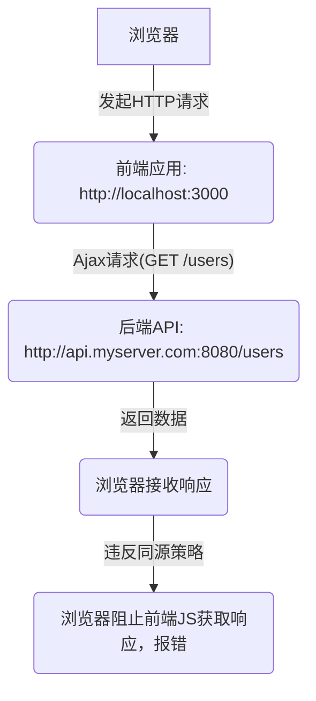

> 在 Web 开发中，**“跨域” (Cross-Origin)** 是一个非常常见且令人困扰的问题。它源于浏览器的一项重要安全策略：**同源策略 (Same-Origin Policy)**。理解同源策略以及如何安全有效地解决跨域问题，是每个 Web 开发者必备的知识。


核心思想：
**同源策略是浏览器的一项安全机制，它限制了来自一个源的文档或脚本与来自另一个源的资源进行交互。当请求的目标源与当前页面的源不一致时，就发生了跨域。解决跨域问题的关键是让服务器端或中间代理明确允许跨域请求。**


------

## 一、什么是同源策略 (Same-Origin Policy)？

**同源策略** 是浏览器为了保护用户隐私和数据安全而制定的一项基本安全功能。它限制了一个 HMTL 文档中加载的脚本如何与来自不同源的资源进行交互。

### 1.1 “源”的定义

如果两个 URL 的**协议 (Protocol)**、**域名 (Domain)** 和**端口 (Port)** 都相同，则称它们是“同源”的。只要其中任何一个不同，就被认为是“跨源”或“不同源”。

| URL A                            | URL B                            | 结果         | 原因                           |
| :------------------------------- | :------------------------------- | :----------- | :----------------------------- |
| `http://example.com/a.html`      | `http://example.com/b.html`      | 同源         | 协议、域名、端口都相同         |
| `http://example.com/a.html`      | `https://example.com/b.html`     | 不同源       | 协议不同 (`http` vs `https`)   |
| `http://example.com/a.html`      | `http://www.example.com/b.html`  | 不同源       | 域名不同 (`example.com` vs `www.example.com`) |
| `http://example.com:8080/a.html` | `http://example.com/b.html`      | 不同源       | 端口不同 (`8080` vs `80` (默认)) |
| `http://example.com/a.html`      | `http://example.org/b.html`      | 不同源       | 域名不同                       |

### 1.2 同源策略的限制范围

同源策略主要限制以下三种类型的跨域行为：

1.  **DOM 访问限制**：不同源的 iframe 无法相互访问 DOM，也无法调用彼此的 JavaScript 方法。
2.  **Web 存储限制**：不同源的 `localStorage`、`sessionStorage`、`IndexedDB` 无法相互访问。
3.  **HTTP 请求限制**：**这是我们通常讨论的“跨域问题”的核心**。浏览器限制从一个源发起的 Ajax 请求不能直接获取来自另一个源的响应数据。

**注意**：同源策略并非阻止所有跨域请求的发出，而是阻止脚本读取和处理跨域响应。例如，``、`<script>`、`<link>` 等标签可以加载跨域资源，但脚本无法获取这些资源的内容（Image 的像素数据、Script 的执行结果等）。

### 1.3 为什么要有同源策略？

同源策略是 Web 安全的基石。如果缺少它，将会导致严重的安全漏洞：
*   **恶意网站窃取用户敏感信息**：例如，你登录了银行网站，然后在另一个标签页打开了一个恶意网站。如果没有同源策略，恶意网站上的 JavaScript 就可以向银行网站发送请求（携带你的身份认证信息，如 Cookie），并读取你的账户余额、交易记录等信息。
*   **伪造请求**：恶意网站可以伪造请求（如发帖、转账），由于浏览器会自动携带 Cookie，可能导致用户在不知情的情况下执行了危险操作。
*   **DOM 篡改**：恶意脚本可以访问并修改其他网站的 DOM 结构，进行钓鱼或其他恶意行为。

## 二、典型的跨域场景

当你在 `http://localhost:3000` 运行前端应用，向 `http://api.myserver.com:8080` 发送后端 API 请求时，就会发生跨域。这是最常见的开发场景。



## 三、跨域解决方案

解决跨域问题的核心思路是绕过或满足同源策略的限制。以下是几种常见的解决方案。

### 3.1 跨域资源共享 (CORS - Cross-Origin Resource Sharing)

CORS 是 W3C 推荐的、最标准、最现代的跨域解决方案。它通过在 HTTP 响应头中添加一组特殊的字段，允许服务器端来明确告知浏览器，哪些源（`Origin`）、哪些 HTTP 方法（`Method`）、哪些自定义请求头（`Headers`）被允许访问其资源。

#### 3.1.1 简单请求 (Simple Requests)

满足以下所有条件的请求被认为是“简单请求”：
*   使用 `GET`、`POST`、`HEAD` 方法。
*   请求头中只有 CORS 安全列表内的字段（例如 `Accept`、`Accept-Language`、`Content-Language`、`Content-Type`），并且 `Content-Type` 只能是 `application/x-www-form-urlencoded`、`multipart/form-data` 或 `text/plain`。
*   **流程**：
    1.  浏览器发送跨域请求时，自动在请求头中添加 `Origin` 字段，值为当前页面的源（例如 `Origin: http://localhost:3000`）。
    2.  服务器接收到请求后，检查 `Origin` 字段。
    3.  如果服务器允许该源访问，则在响应头中添加 `Access-Control-Allow-Origin` 字段，值为请求的 `Origin` 或 `*` (表示允许所有源)。
    4.  浏览器收到响应后，检查响应头。如果存在有效的 `Access-Control-Allow-Origin`，且与当前请求的 `Origin` 匹配，则允许脚本访问响应数据；否则抛出跨域错误。

**示例 (服务器端响应头)：**
```http
HTTP/1.1 200 OK
Content-Type: application/json
Access-Control-Allow-Origin: http://localhost:3000  // 允许来自此源的请求
// 或者 Access-Control-Allow-Origin: *            // 允许所有源
```

#### 3.1.2 预检请求 (Preflight Requests)

不满足“简单请求”条件的请求（例如使用 `PUT`/`DELETE` 方法，或发送 `Content-Type: application/json` 的请求），在发送实际请求之前，会先发送一个 `OPTIONS` 方法的“预检请求”到服务器，以询问服务器是否允许该跨域请求。

*   **流程**：
    1.  浏览器发送一个 `OPTIONS` 请求，请求头包含：
        *   `Origin`: 当前页面的源。
        *   `Access-Control-Request-Method`: 实际请求将使用的 HTTP 方法。
        *   `Access-Control-Request-Headers`: 实际请求将发送的自定义请求头。
    2.  服务器接收到 `OPTIONS` 请求后，检查这些信息。如果服务器允许该实际请求，则在响应头中包含：
        *   `Access-Control-Allow-Origin`: 允许的源。
        *   `Access-Control-Allow-Methods`: 允许的 HTTP 方法。
        *   `Access-Control-Allow-Headers`: 允许的自定义请求头。
        *   `Access-Control-Max-Age`: 预检请求的缓存时间（秒），在此时间内浏览器无需再次发送预检请求。
    3.  浏览器接收到预检响应后，如果确认允许，**才会发送真正的实际请求**。否则，直接抛出跨域错误。

**示例 (服务器端 `OPTIONS` 响应头)：**
```http
HTTP/1.1 204 No Content // 204 表示无内容
Access-Control-Allow-Origin: http://localhost:3000
Access-Control-Allow-Methods: GET, POST, PUT, DELETE
Access-Control-Allow-Headers: Content-Type, Authorization // 允许携带 Content-Type 和 Authorization 头
Access-Control-Max-Age: 86400 // 缓存预检结果24小时
```

#### 3.1.3 携带凭证的请求 (Credentials)

默认情况下，浏览器发起的跨域请求不会携带 `Cookie`、HTTP 认证信息等凭证。如果需要携带凭证，需要：
1.  **客户端设置**：在 Ajax 请求中设置 `withCredentials = true` (例如 Axios 的 `withCredentials: true`)。
2.  **服务器端设置**：在响应头中添加 `Access-Control-Allow-Credentials: true`。**注意：如果设置了 `Access-Control-Allow-Credentials: true`，则 `Access-Control-Allow-Origin` 不能设置为 `*`，必须是明确的源。**

**CORS 优势**：
*   **标准解决方案**：由 W3C 规范定义，是官方推荐的方式。
*   **功能全面**：支持各种 HTTP 方法和请求头，可以携带凭证。
*   **部署简单**：只需要配置服务器端即可。

**CORS 劣势**：
*   **需要服务器端支持**：如果无法修改后端配置，则无法使用。
*   **预检请求开销**：对于非简单请求，会多一次 `OPTIONS` 请求的往返延迟。

### 3.2 JSONP (JSON with Padding)

JSONP 是一种非官方的、利用 `<script>` 标签没有同源策略限制的“漏洞”来实现跨域请求的旧有技术。它只支持 `GET` 请求。

*   **原理**：
    1.  客户端定义一个 JavaScript 回调函数（例如 `myCallback`）。
    2.  客户端通过动态创建 `<script>` 标签，其 `src` 属性指向跨域的 API 接口，并在 URL 参数中包含回调函数名（例如 `?callback=myCallback`）。
    3.  服务器接收到请求后，将数据包裹在指定的回调函数中返回，例如 `myCallback({"data": "some value"})`。
    4.  浏览器加载 `<script>` 标签，执行返回的 JavaScript 代码，从而调用客户端定义的回 `myCallback` 函数，并将数据作为参数传入。

**客户端 (HTML/JS)：**
```html
<script>
function handleData(data) {
  console.log("Received data:", data);
}

// 动态创建 script 标签
var script = document.createElement('script');
script.src = 'http://api.myserver.com:8080/data?callback=handleData';
document.body.appendChild(script);
</script>
```

**服务器端 (响应)：**
```javascript
// 当请求 http://api.myserver.com:8080/data?callback=handleData 时
// 返回的响应内容：
handleData({"message": "Hello from server via JSONP!"});
```

**JSONP 优势**：
*   **兼容性好**：支持所有现代浏览器，包括一些老旧浏览器。
*   **支持 GET 请求的数据传输**：可以获取数据。

**JSONP 劣势**：
*   **只支持 GET 请求**：无法发送 `POST`、`PUT` 等请求。
*   **安全性差**：`script` 标签加载的 JS 代码拥有完整的页面权限，如果第三方 API 不可信，可能存在 XSS 漏洞。
*   **维护困难**：需要服务器端和客户端配合，逻辑相对复杂。
*   **已不被推荐**：在 CORS 普及后，JSONP 很少用于新项目。

### 3.3 代理 (Proxy)

代理是一种非常通用的解决跨域问题的方法，尤其是当前后端分离开发时。其原理是：**让同源的服务器去请求跨域的服务器，然后将结果返回给客户端。** 这样，客户端发送的请求都是同源的，避免了浏览器端的跨域限制。

#### 3.3.1 开发环境代理

在前端开发环境中，通常使用 Webpack Dev Server、Vite Dev Server 或 Nginx 进行代理。

**Webpack Dev Server 配置示例：**
```javascript
// webpack.config.js
module.exports = {
  // ... 其他配置
  devServer: {
    port: 3000,
    proxy: {
      '/api': { // 凡是请求路径以 '/api' 开头的，都会被代理
        target: 'http://api.myserver.com:8080', // 目标服务器地址
        changeOrigin: true, // 改变源，将请求的 Host 头设置为 target 的 Host
        pathRewrite: { '^/api': '' }, // 重写路径：将 '/api' 替换为空字符串
      },
    },
  },
};
```
当前端代码请求 `http://localhost:3000/api/users` 时，Webpack Dev Server 会将请求转发到 `http://api.myserver.com:8080/users`。对于浏览器而言，请求的目标仍是 `http://localhost:3000`，因此是同源的。

#### 3.3.2 生产环境代理 (Nginx)

在生产环境中，最常见的方式是使用 Nginx 作为反向代理。将前端应用和后端 API 部署在同一个域名下，通过 Nginx 进行区分和转发。

```nginx
# nginx.conf 配置示例
server {
    listen 80;
    server_name www.yourfrontend.com; # 前端域名

    location / {
        root /path/to/your/frontend/dist; # 前端静态文件目录
        index index.html;
        try_files $uri $uri/ /index.html;
    }

    location /api/ {
        proxy_pass http://api.myserver.com:8080/;   # 后端API地址
        proxy_set_header Host $host;                # 保持原始请求的Host头
        proxy_set_header X-Real-IP $remote_addr;
        proxy_set_header X-Forwarded-For $proxy_add_x_forwarded_for;
    }
}
```
当浏览器请求 `http://www.yourfrontend.com/api/users` 时，Nginx 会将 `/api/` 路径的请求转发给 `http://api.myserver.com:8080` (后端服务)，并将结果返回给浏览器。对浏览器而言，所有请求都发往 `www.yourfrontend.com`，因此没有跨域问题。

**代理优势**：
*   **根本解决**：从根本上解决了浏览器端的跨域限制，所有客户端请求都是同源的。
*   **安全性高**：服务器之间传输数据没有浏览器的同源限制，可以更好地控制。
*   **通用性强**：支持所有 HTTP 方法和各种请求头，可以携带凭证。
*   **对后端无侵入**：后端 API 无需为跨域额外修改代码。

**代理劣势**：
*   **增加部署复杂性**：需要额外的代理服务器配置。
*   **可能增加一层网络延迟**：请求会经过代理服务器再到达目标服务器。

### 3.4 WebSocket

WebSocket 协议是独立于 HTTP 的协议，它本身不受同源策略的限制。一旦 WebSocket 连接建立，就可以实现全双工的、跨域的数据传输。

**优势**：
*   **天生跨域**：WebSocket 握手请求受同源策略限制，但一旦握手成功，数据帧传输不受限制。
*   **实时通信**：适用于需要低延迟、高频率双向通信的场景。

**劣势**：
*   **协议不同**：不适用于传统的 RESTful API 请求。
*   **服务器端和客户端都需要实现 WebSocket 协议**。

### 3.5 postMessage (窗口间通信)

`window.postMessage()` 方法提供了一种安全的方式，允许来自不同源的窗口（如 `window`、`iframe`、`弹出窗口`）之间进行通信。

```javascript
// 页面 A (http://a.com)
let iframe = document.getElementById('myIframe');
iframe.contentWindow.postMessage('Hello from A!', 'http://b.com'); // 发送消息给 B

window.addEventListener('message', function(event) {
    if (event.origin === 'http://b.com') { // 验证消息来源
        console.log('Received from B:', event.data);
    }
});

// 页面 B (http://b.com) 在 iframe 中
window.addEventListener('message', function(event) {
    if (event.origin === 'http://a.com') { // 验证消息来源
        console.log('Received from A:', event.data);
        event.source.postMessage('Hello from B!', event.origin); // 回复给 A
    }
});
```

**优势**：
*   **安全**：可以验证消息来源 `event.origin`。
*   **特定场景**：主要用于父子窗口、兄弟窗口或 iframe 之间的消息传递。

**劣势**：
*   **不适用于 Ajax 请求**：无法用于解决普通的 HTTP API 跨域问题。

### 3.6 其他（不常用或不推荐）

*   **document.domain**：主要用于主域和子域之间的跨域，通过设置 `document.domain` 为相同的顶级域名来实现。例如，`a.example.com` 和 `b.example.com` 可以都设置为 `document.domain = 'example.com'`。但现在已不常推荐，且有安全隐患。
*   **web-worker**：Web Worker 本身受同源策略限制，其内部的代码仍然不能直接发送跨域 Ajax 请求。
*   **图片打点/Beacon**：早期用于统计场景，通过 `` 标签的 `src` 属性发送 `GET` 请求，不关心返回数据，只用于日志上报等。但无法获取响应。

## 四、选择合适的解决方案

选择哪种跨域解决方案取决于您的具体场景和对后端服务器的控制能力。

*   **首选 CORS**：如果能修改后端代码，CORS 是最标准、最推荐的解决方案。
*   **开发环境代理**：在开发前端时，使用代理是最高效、最便捷的方式，无须修改后端。
*   **生产环境代理 (Nginx)**：当前端和后端部署在不同端口或服务时，使用 Nginx 等服务器层代理，将所有请求路由到同一域名下，是生产环境的常见做法。
*   **JSONP (遗留系统)**：仅在需要兼容老旧浏览器，且只涉及 `GET` 请求时作为备选，不推荐新项目使用。
*   **postMessage**：用于不同窗口之间的安全通信。
*   **WebSocket**：用于实时双向通信，不适用于传统 RESTful API。

## 五、总结

跨域问题是 Web 开发中最常见的挑战之一，但有了同源策略，Web 应用程序才得以在相对安全的沙箱中运行。通过理解同源策略的原理，并掌握 CORS、代理等主流解决方案，开发者可以有效地应对各种跨域场景，构建稳定且安全的 Web 应用。在现代开发中，**CORS 和服务器代理是解决多数 HTTP 请求跨域问题的黄金搭档。**