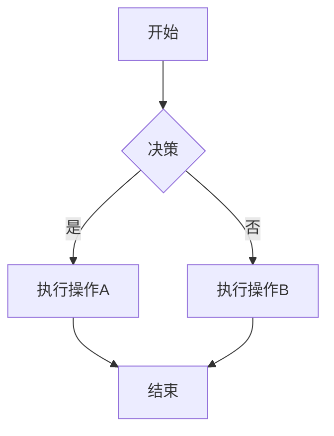

> **Markdown** 是一种**轻量级标记语言 (lightweight markup language)**，它允许人们使用易读易写的纯文本格式编写文档，然后可以将其转换为结构化的 HTML（或其他格式）。Markdown 的目标是实现**“易于阅读、易于编写”**，其语法设计旨在尽可能地保持可读性，即使是在纯文本状态下也能够清晰地理解其内容。


**核心思想**：**通过简单的符号（如 `#`, `*`, `-` 等）来表示文本的格式和结构，专注于内容创作本身，而非复杂的排版细节。**

------

## 一、Markdown 简介

Markdown 于 2004 年由 John Gruber 创立，其灵感来源于电子邮件的纯文本标记约定。它的主要优势在于：

*   **简洁易学**：语法简单直观，上手快。
*   **纯文本**：内容以纯文本形式存储，与平台无关，具有极佳的兼容性和可移植性。
*   **版本控制友好**：纯文本文件易于在版本控制系统（如 Git）中进行差异比较和管理。
*   **易于转换**：可以轻松转换为 HTML、PDF 等多种格式。
*   **专注于内容**：让作者将注意力集中在内容而不是格式上。

### 1.1 Markdown 的“方言”与标准

由于 Markdown 规范最初并未完全标准化，因此出现了许多不同的“方言”或扩展版本。其中最常见的包括：

*   **CommonMark**：一个旨在解决 Markdown 规范模糊性、提供明确且一致的规范的项目。大多数现代 Markdown 解析器都力求兼容 CommonMark。
*   **GitHub Flavored Markdown (GFM)**：GitHub 推广并使用的 Markdown 方言，是 CommonMark 的超集，增加了任务列表、表格、删除线等功能，广泛应用于开源社区和文档编写。

本文将主要介绍 CommonMark 及其在 GFM 中常见的扩展语法。

## 二、基本语法元素

### 2.1 标题 (Headings)

Markdown 支持六级标题，通过在行首添加一个或多个 `#` 符号来表示，`#` 的数量对应标题的级别。

**语法：**

```markdown
# 这是一级标题
## 这是二级标题
### 这是三级标题
#### 这是四级标题
##### 这是五级标题
###### 这是六级标题
```

**渲染效果：**

# 这是一级标题
## 这是二级标题
### 这是三级标题
#### 这是四级标题
##### 这是五级标题
###### 这是六级标题

### 2.2 段落与换行 (Paragraphs and Line Breaks)

**段落**由一个或多个连续的文本行组成，不同段落之间用一个或多个空行分隔。

**换行 (Line Break)**：
*   **软换行 (Soft Line Break)**：在行末尾添加两个或更多的空格，然后换行。这通常在渲染时被视为一个普通的空格，但在某些解析器中会强制换行。
*   **硬换行 (Hard Line Break)**：在两段文字之间加入一个空行。这会创建新的段落，在 HTML 中通常是 `<p>` 标签。

**语法：**

```markdown
这是一个段落。

这是另一个段落。

这是一个
带有两个空格的软换行
新的一行。
```

**渲染效果：**

这是一个段落。

这是另一个段落。

这是一个
带有两个空格的软换行
新的一行。

### 2.3 强调 (Emphasis)

用于文本的加粗、斜体或两者兼有。

**语法：**

```markdown
*斜体文字* 或 _斜体文字_
**加粗文字** 或 __加粗文字__
***加粗斜体文字*** 或 ___加粗斜体文字___
```

**渲染效果：**

*斜体文字* 或 _斜体文字_
**加粗文字** 或 __加粗文字__
***加粗斜体文字*** 或 ___加粗斜体文字___

### 2.4 列表 (Lists)

Markdown 支持无序列表和有序列表，并且可以嵌套。

#### 2.4.1 无序列表 (Unordered Lists)

使用 `*`、`-` 或 `+` 符号作为列表项标记。

**语法：**

```markdown
* 列表项 A
* 列表项 B
  - 嵌套列表项 B.1
  - 嵌套列表项 B.2
* 列表项 C
```

**渲染效果：**

* 列表项 A
* 列表项 B
  - 嵌套列表项 B.1
  - 嵌套列表项 B.2
* 列表项 C

#### 2.4.2 有序列表 (Ordered Lists)

使用数字后跟一个点号 (`.`) 作为列表项标记。数字的实际值不重要，Markdown 会自动按顺序渲染。

**语法：**

```markdown
1. 列表项一
2. 列表项二
   1. 嵌套列表项 2.1
   2. 嵌套列表项 2.2
3. 列表项三
```

**渲染效果：**

1. 列表项一
2. 列表项二
   1. 嵌套列表项 2.1
   2. 嵌套列表项 2.2
3. 列表项三

### 2.5 链接 (Links)

链接可以将文本转换为可点击的超链接。

**语法：**

```markdown
行内式链接：[链接文本](https://www.example.com "链接标题")
引用式链接：[链接文本][id]

在文档的其他位置定义链接：
[id]: https://www.example.com/another "另一个链接标题"
```

**渲染效果：**

行内式链接：[链接文本](/188567a93394 "链接标题")
引用式链接：[链接文本][id]

在文档的其他位置定义链接：
[id]: https://www.example.com/another "另一个链接标题"

### 2.6 图片 (Images)

图片语法与链接类似，只是在前面多一个感叹号 `!`。

**语法：**

```markdown
行内式图片：
引用式图片：![图片描述][image_id]

在文档的其他位置定义图片：
[image_id]: https://www.example.com/another_image.png "另一张图片标题"
```

**渲染效果：**

行内式图片：
引用式图片：![图片描述][image_id]

在文档的其他位置定义图片：
[image_id]: https://www.example.com/another_image.png "另一张图片标题"

### 2.7 代码 (Code)

用于显示代码片段。

#### 2.7.1 行内代码 (Inline Code)

使用反引号 (`` ` ``) 包裹代码。

**语法：**

```markdown
这是一个行内代码示例：`print("Hello, World!")`。
```

**渲染效果：**

这是一个行内代码示例：`print("Hello, World!")`。

#### 2.7.2 代码块 (Code Blocks)

使用三个反引号 (``` ` ``) 或三个波浪线 (`~~~`) 包裹代码块，可以在第一个标记后指定语言进行语法高亮。

**语法：**

~~~markdown
```python
def factorial(n):
    if n == 0:
        return 1
    else:
        return n * factorial(n-1)

print(factorial(5))
```

```go
package main

import "fmt"

func main() {
    fmt.Println("Hello, Go!")
}
```
~~~

**渲染效果：**

```python
def factorial(n):
    if n == 0:
        return 1
    else:
        return n * factorial(n-1)

print(factorial(5))
```

```go
package main

import "fmt"

func main() {
    fmt.Println("Hello, Go!")
}
```

### 2.8 引用 (Blockquotes)

用于引用其他来源的文本，通过在行首添加 `>` 符号。可以嵌套。

**语法：**

```markdown
> 这是一段引用文本。
> 这是引用的第二行。
>
>> 这是嵌套引用。
> 这是回到第一层引用。
```

**渲染效果：**

> 这是一段引用文本。
> 这是引用的第二行。
>
>> 这是嵌套引用。
> 这是回到第一层引用。

### 2.9 分隔线 (Horizontal Rules)

使用三个或更多个 `*`、`-` 或 `_` 符号来创建一条水平分隔线。

**语法：**

```markdown
***

---

___
```

**渲染效果：**

***

---

___

## 三、扩展语法 (GitHub Flavored Markdown - GFM)

GFM 在 CommonMark 的基础上增加了一些常用功能。

### 3.1 表格 (Tables)

通过使用 `|` 符号分隔列，`-` 符号分隔表头和表体。

**语法：**

```markdown
| 列标题 1 | 列标题 2 | 列标题 3 |
| :------- | :------: | -------: |
| 左对齐   | 居中对齐 | 右对齐   |
| 内容 A   | 内容 B   | 内容 C   |
| 内容 D   | 内容 E   | 内容 F   |
```

**渲染效果：**

| 列标题 1 | 列标题 2 | 列标题 3 |
| :------- | :------: | -------: |
| 左对齐   | 居中对齐 | 右对齐   |
| 内容 A   | 内容 B   | 内容 C   |
| 内容 D   | 内容 E   | 内容 F   |

### 3.2 任务列表 (Task Lists)

在列表项前添加 `[ ]` 或 `[x]` 来表示未完成或已完成的任务。

**语法：**

```markdown
- [x] 已完成任务
- [ ] 未完成任务
  - [ ] 嵌套未完成任务
- [x] 另一个已完成任务
```

**渲染效果：**

- [x] 已完成任务
- [ ] 未完成任务
  - [ ] 嵌套未完成任务
- [x] 另一个已完成任务

### 3.3 删除线 (Strikethrough)

使用两个波浪线 `~~` 包裹文本以表示删除。

**语法：**

```markdown
这是要~~删除~~的文本。
```

**渲染效果：**

这是要~~删除~~的文本。

### 3.4 自动链接 (Autolinks)

GFM 会自动将 URL 和邮箱地址转换为链接，无需额外的 `[]()` 语法。

**语法：**

```markdown
访问我的网站：https://www.example.com
我的邮箱是：test@example.com
```

**渲染效果：**

访问我的网站：https://www.example.com
我的邮箱是：test@example.com

### 3.5 转义字符 (Escaping Characters)

如果想在文本中显示 Markdown 语法字符本身，而不是让它被解析，可以在字符前面加上反斜杠 `\` 进行转义。

**语法：**

```markdown
我希望显示星号 \* 而不是斜体。
这是一个反斜杠：\\
```

**渲染效果：**

我希望显示星号 \* 而不是斜体。
这是一个反斜杠：\\

## 四、特殊功能（通常通过扩展支持）

### 4.1 YAML Front Matter

在 Markdown 文件的开头，使用三条破折号 (`---`) 包裹的 YAML 块，用于定义文档的元数据，如标题、日期、标签等。这在静态网站生成器（如 Hugo, Jekyll）和某些 Markdown 编辑器中非常常见。

**语法：**

```yaml
---
title: 文档标题
author: 作者名称
date: 2024-03-24
tags:
  - 标签A
  - 标签B
---
```

### 4.2 Mermaid 图表

许多 Markdown 解析器和平台支持集成 Mermaid 语法，用于绘制流程图、序列图、甘特图等。

**语法：**



**渲染效果：**


graph TD
    A[开始] --> B{决策};
    B -- 是 --> C[执行操作A];
    B -- 否 --> D[执行操作B];
    C --> E[结束];
    D --> E;


### 4.3 MathJax 公式

对于需要显示数学公式的文档，MathJax 可以在 Markdown 中渲染 LaTeX 风格的公式。

**语法：**

```latex
行内公式：$E=mc^2$
块级公式：
$$
\int_{-\infty}^{\infty} e^{-x^2} dx = \sqrt{\pi}
$$
```

**渲染效果：**

行内公式：$E=mc^2$
块级公式：
$$
\int_{-\infty}^{\infty} e^{-x^2} dx = \sqrt{\pi}
$$

## 五、总结

Markdown 以其简洁、直观和高效的特性，已成为撰写技术文档、博客文章、README 文件以及各种笔记的流行选择。掌握其基本语法和常用扩展，能够极大地提升文档编写的效率和可维护性。无论是日常记录还是专业写作，Markdown 都能提供一种专注于内容、脱离繁琐排版细节的愉悦体验。随着工具和平台的不断发展，Markdown 的应用场景将更加广泛。